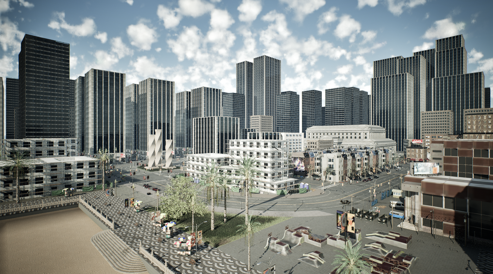
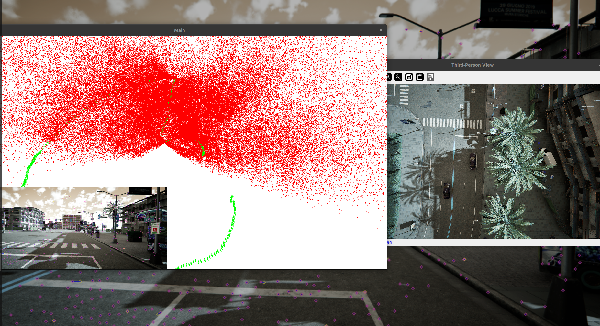
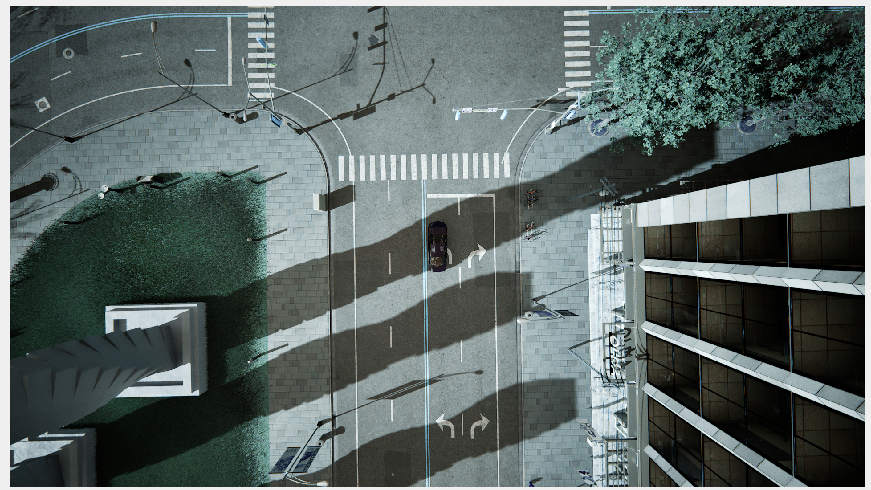
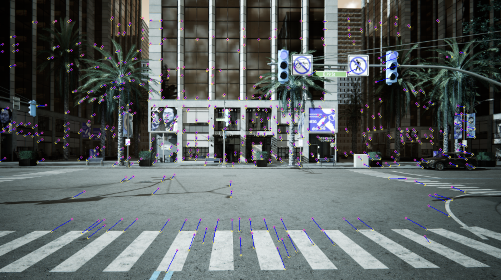
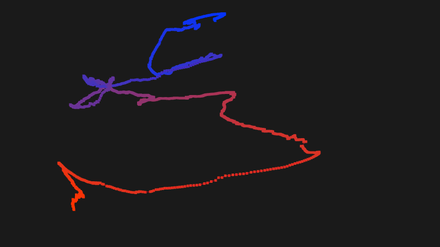

# CARLA SLAM

A Monocular Visual SLAM (Simultaneous Localization and Mapping) implementation that works with the CARLA autonomous driving simulator.

## Overview

This project implements a visual SLAM system that runs on camera data from the CARLA simulator. It tracks vehicle movement through the environment, triangulates 3D points, and saves camera poses to file.

## Features

- Visual feature extraction and matching between frames
- Triangulation of 3D points from matched features
- Real-time visualization of camera trajectory and 3D point cloud
- Automatic driving using CARLA's traffic manager
- Handling of traffic lights and collision avoidance
- Pose saving in TUM RGB-D dataset format

## Requirements

- Python 3.7+
- CARLA Simulator
- OpenCV
- NumPy

## Installation

1. Install CARLA following the [official installation guide](https://carla.readthedocs.io/en/latest/start_quickstart/) and the CARLA environment from [here](https://github.com/carla-simulator/carla/releases)

## Usage
1. This scipt uses some of the code already present in **monocular_slam** project in this repository
2. Run the CARLA simulator first
```
./CarlaUnreal.sh
```
3. Run the **carla_slam.py** file
## How It Works

The system performs the following steps:
1. Connects to CARLA simulator and spawns a vehicle with cameras
2. Drives the vehicle automatically using CARLA's traffic manager
3. Uses CARLA based autopilot to move in the environment and turns
3. Extracts visual features from camera frames
4. Matches features between consecutive frames
5. Calculates camera motion (vehicle pose)
6. Triangulates 3D points from matched features
7. Visualizes the trajectory and point cloud
8. Saves camera poses to a file in TUM RGB-D format

## Output

The system generates:
- Real-time visualization of the SLAM process
- `poses.txt` file with camera poses in the format: timestamp tx ty tz qx qy qz qw
- A window showing a top down view of the vehicle being driven
- A window showing live poses and CARLA simulator as the vehicle progresses

## Results
  - `carla_env.png` - Screenshot of the CARLA environment
  
  - `all_views.png` - Composite image showing multiple camera views
  
  - `top_down.png` - Bird's eye view of the vehicle and environment
  
  - `traffic.png` - Visualization of CARLA autopilot traffic detection capabilities
  
  - `trajectory.png` - Visualization of the vehicle's trajectory (green line)
  

  Click on the link to view the visualization [[Carla Video]](images/compressed_carla.mp4)