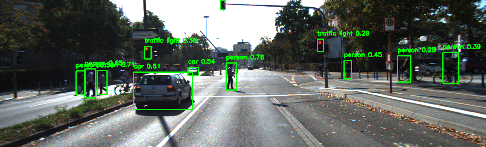
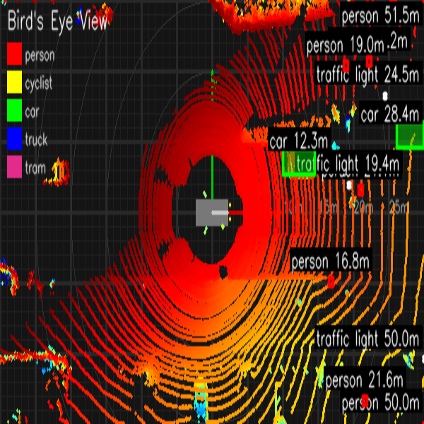
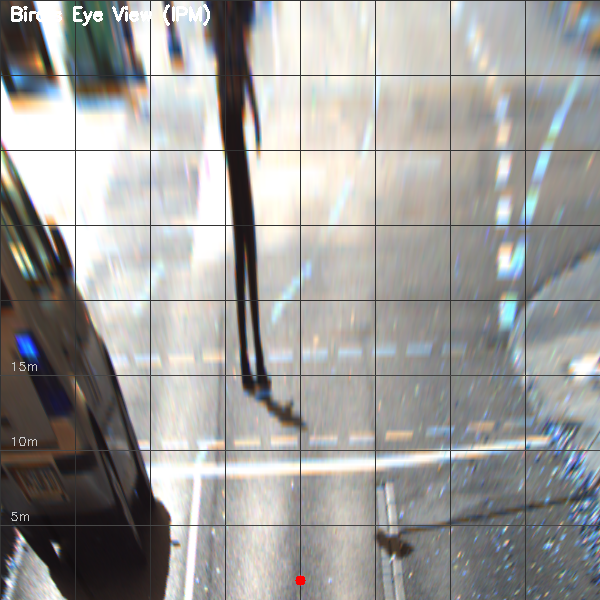
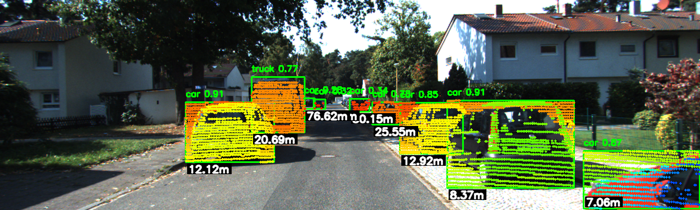
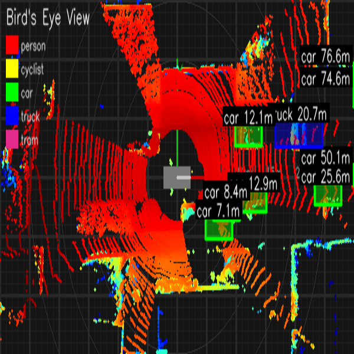
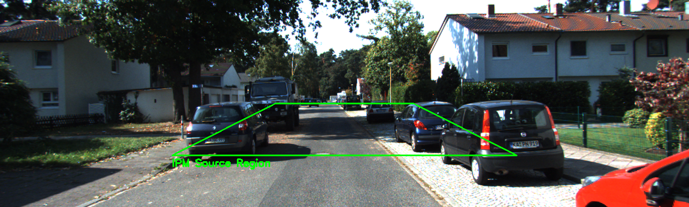
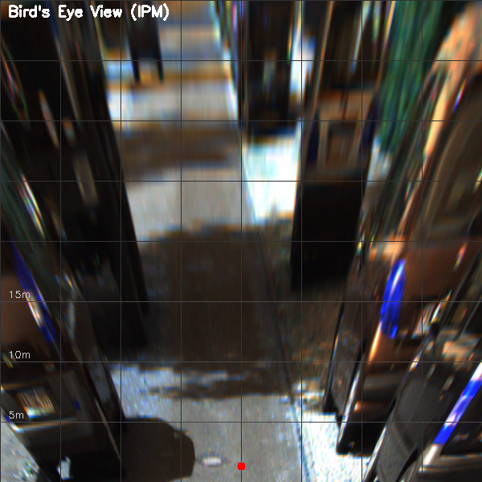

# Project: LiDAR-Camera Fusion, Object Detection with Inverse Perspective mapping (IPM) based Birds Eye View (BEV)

This project demonstrates the process of fusing LiDAR point clouds with camera images to enhance object detection using YOLOv8. The fusion process projects LiDAR points onto image frames and detects obstacles via a deep learning-based model.

## 🚗 Key Features

- **YOLOv8-based object detection** on camera images.
- **LiDAR-camera calibration and fusion**, with 3D point projection.
- **IPM-based BEV transformation** for top-down view generation.
- **Per-frame visualization** and **video output** in multiple views (camera, BEV, combined).
- Outputs include images and videos for better interpretability.

## 📂 File Descriptions

### `early_fusion.py`
This script serves as the entry point for the project. It reads input images, point clouds, and calibration files, and then processes them through the pipeline to detect objects using YOLO and fuse LiDAR points with camera images.

### `detect_obstacle.py`
Contains the implementation of the YOLOv8-based object detection class `YoloOD`. It supports both tiny and normal models for detecting objects in the provided camera frames.

### `transform_lidar_camera.py`
Implements the `LiDAR2Camera` class responsible for transforming LiDAR points to the camera coordinate system, projecting them onto images, and filtering outliers. It also includes functions for performing fusion and calculating distance to detected objects.

### `gen_video.py`
Creates a video from a series of images and point clouds by applying the LiDAR-Camera fusion and YOLO-based object detection pipeline to each frame. It saves the processed frames and generates a video as output.

### `bev_visualizer.py`
 Contains the EnhancedBEVVisualizer class that creates bird's eye view visualizations of LiDAR point clouds with detected objects. It includes functions for creating a base image with grid lines, drawing 3D bounding boxes, adding class labels, and creating a legend.

 ### `bev.py`
 It defines functions for processing single frames and entire datasets, setting up the pipeline to:

- Process camera images and LiDAR point clouds
- Detect objects using YOLO
- Perform LiDAR-camera fusion
- Create BEV visualizations
- Generate output images and videos
- Includes a command-line interface for easy use

 ### `IPM/ipm.py`
 Contains the `CameraToBEV` class for generating BEV images from camera views using Inverse Perspective Mapping. Also includes grid overlays, source region visualization, and object projection support.

### `IPM/main.py`
Processes an entire dataset of frames, applies the full fusion pipeline, and generates camera, BEV, and combined view videos using IPM.

## 🔧 Requirements
- Python 3.8+
- OpenCV
- Open3D
- Ultralytics YOLOv8
- NumPy
- Matplotlib

## 🚀 Usage
- Run `early_fusion.py` to process a single frame.
- Run `gen_video.py` to generate a video from a series of frames.
- Run `IPM/main.py` for generating camera views and IPN

## 📂 Output
- Processed frames saved to the `output_images` directory.
- Generated video saved as `out.mp4`.

---
## 🔍 Sample Outputs

### Output Example 1

### Lidar Output Example 1

### IPM Output Example 1

### Output Example 2

### Lidar Output Example 2

### IPM Output Example 2 Trapezoid Coverage Area

### IPM Output Example 2

