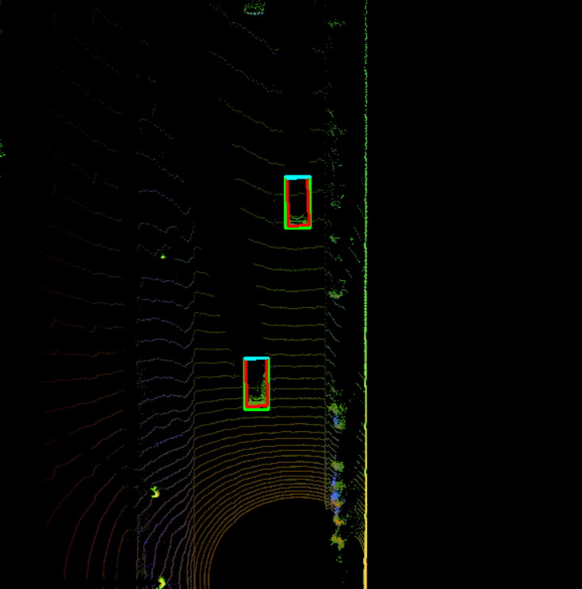
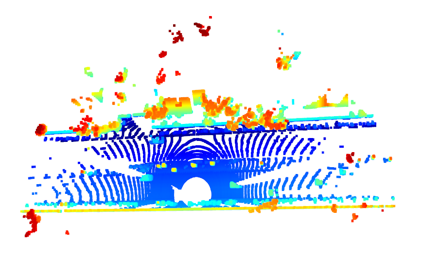
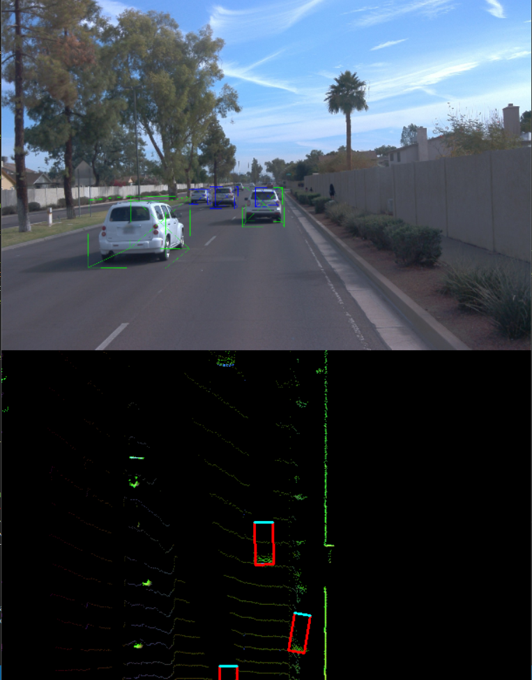
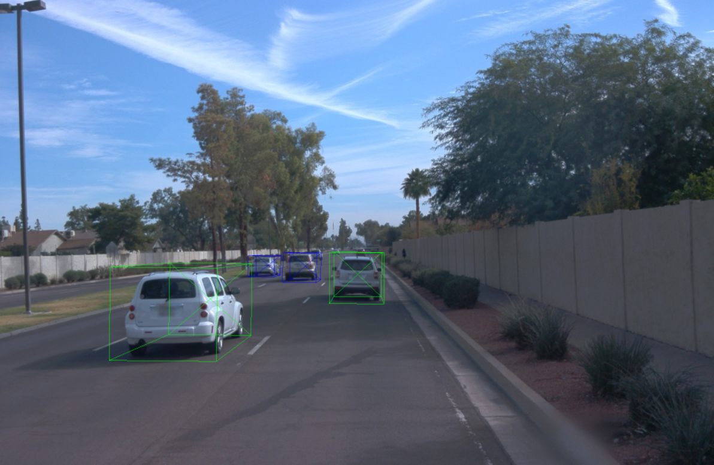
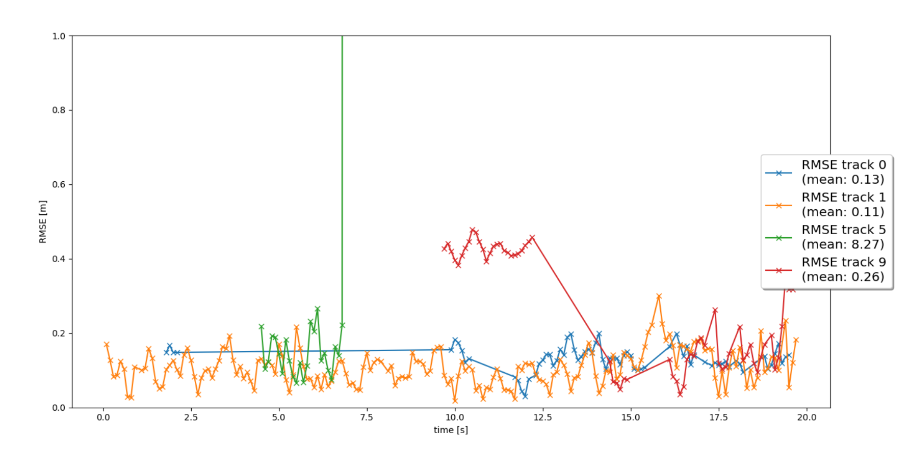
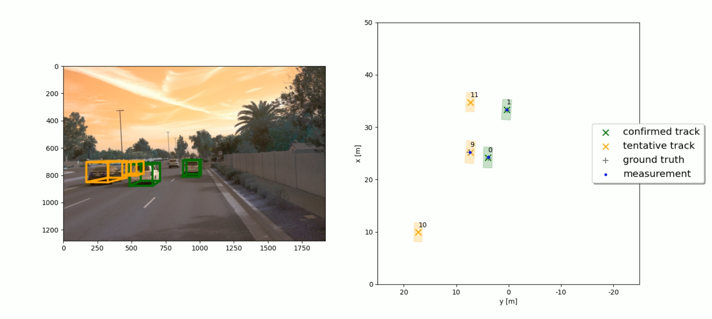

# Waymo Open Dataset 3D Object Detection and Tracking

## Overview
This repository implements 3D object detection and tracking using the Waymo Open Dataset. The system processes lidar point clouds and camera images to detect vehicles and track them across frames using Kalman filtering.

## Features
- Point cloud processing from Waymo Open Dataset
- Birds-eye view (BEV) generation
- 3D object detection using configurable models (FPN-ResNet or Darknet)
- Object validation and performance measurement
- Kalman filter-based tracking
- Multiple visualization options for results

## Requirements
- Python 3.x
- NumPy
- OpenCV
- Matplotlib
- TensorFlow
- Waymo Open Dataset reader

## Directory Structure
```
.
├── dataset/                           # Waymo dataset files
├── results/                           # Output files
├── waymo_reader/                      # Waymo dataset utilities
│   └── simple_waymo_open_dataset_reader/
├── tools/                             # Helper functions
│   ├── pcl.py                         # Point cloud processing
│   ├── lidar_detect.py                # Object detection
│   └── misc.py                        # Miscellaneous helpers
├── kalman_filter/                     # Tracking implementation
│   ├── filter.py                      # Kalman filter
│   ├── track_management.py            # Track management
│   ├── association.py                 # Data association
│   ├── measurements.py                # Sensor measurements
│   └── params.py                      # Tracking parameters
├── plots.py                           # Visualization code
└── eval.py                            # Evaluation metrics
```

## Usage
1. Place Waymo Open Dataset files in the `dataset` directory
2. Configure parameters in the main script:
   - Select dataset file (`data_filename`)
   - Choose frame range (`show_only_frames`)
   - Select detector model (`configs_det`)
   - Configure execution options (`exec_detection`, `exec_tracking`, `exec_visualization`)
3. Run the main script:
   ```
   python main.py
   ```

## Configuration Options
The script provides several configuration options:
- `exec_detection`: Select detection steps to execute
  - `'bev_from_pcl'`: Generate birds-eye view from point cloud
  - `'detect_objects'`: Run object detection
  - `'validate_object_labels'`: Validate ground truth labels
  - `'measure_detection_performance'`: Evaluate detection performance
- `exec_tracking`: Select tracking steps
  - `'perform_tracking'`: Run Kalman filter tracking
- `exec_visualization`: Select visualization options
  - `'show_range_image'`: Display lidar range image
  - `'show_bev'`: Display birds-eye view
  - `'show_pcl'`: Show 3D point cloud
  - `'show_labels_in_image'`: Project labels onto camera image
  - `'show_objects_and_labels_in_bev'`: Show detections and labels in BEV
  - `'show_objects_in_bev_labels_in_camera'`: Show BEV and camera projections
  - `'show_tracks'`: Visualize tracking results
  - `'show_detection_performance'`: Display detection metrics
  - `'make_tracking_movie'`: Generate tracking visualization video

## Detection Models
The system supports two detection architectures:
- FPN-ResNet: Feature Pyramid Network with ResNet backbone
- Darknet: YOLO-based detection network

## Tracking
Object tracking is performed using:
- Kalman Filter for state estimation
- Multi-hypothesis data association
- Track management for initialization and deletion

## Output
The script generates several outputs:
- Visualization windows for different views
- Detection performance metrics
- Tracking results and RMSE plots
- Optional movie of tracking results

## Results

### Visualization Types

#### LiDAR Processing
- **Point Cloud Visualization**: 3D representation of LiDAR points
- **Bird's-Eye View (BEV)**: Top-down 2D projection of the environment
- **Range Image**: Visual representation of LiDAR range measurement




#### Camera Integration
- **Label Projection**: Object labels projected onto camera images
- **Combined Views**: Split screen showing camera and LiDAR with matched detections


#### Object Detection
- **Bounding Boxes**: Red rectangles with cyan borders showing detected vehicles
- **Detection Confidence**: Color-coded boxes showing detection confidence
- **Ground Truth Labels**: Green bounding boxes for validation


#### Tracking Visualization
- **Track History**: Colored lines showing object movement over time
- **RMSE Plots**: Error metrics for each tracked object
- **Track IDs**: Numeric identifiers for each tracked vehicle


#### Video
Split-screen display showing camera view with colored bounding boxes (left) and bird's-eye view tracking map with vehicle positions (right)



Click on the link to view the visualization [[Tracking Video]](results/my_tracking_result.avi)

