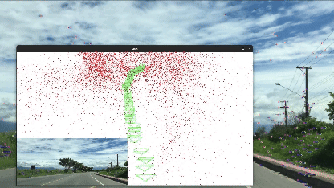
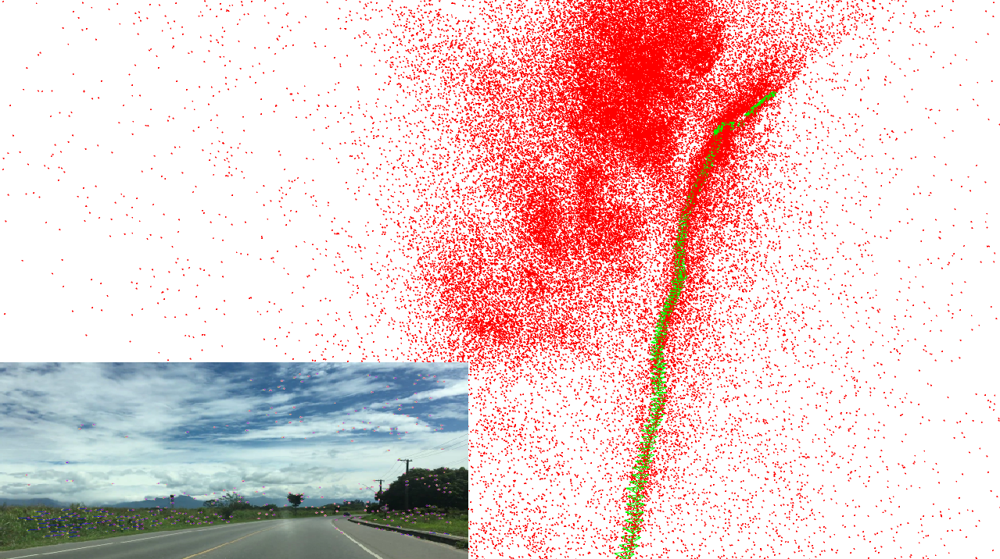

# 🔍 Visual SLAM System

This project implements a basic **Visual SLAM (Simultaneous Localization and Mapping)** system using Python, OpenCV, and Pangolin. It tracks camera motion and reconstructs a sparse 3D map from a monocular video input.

---

## 📁 Project Structure

```
.
├── main.py           # Main entry point: loads video & runs SLAM
├── extractor.py      # Feature extraction, matching, pose estimation
├── pointmap.py       # 3D map and visualization using Pangolin
├── display.py        # SDL2-based frame viewer
├── videos/
│   └── car.mp4       # Sample video for SLAM input
└── README.md         # Project documentation
```

---

## 🚀 Features

- ORB feature extraction and tracking
- Fundamental matrix + pose estimation
- 3D point triangulation
- Real-time SDL2 frame display
- 3D map & camera pose visualization using Pangolin

---

## 📦 Dependencies

Make sure you have the following installed:

```bash
pip install opencv-python-headless
pip install scikit-image
pip install numpy
pip install PyOpenGL
pip install PySDL2
pip install pangolin
```

> ⚠️ **Note**: Pangolin Python bindings may require manual installation or system-level dependencies.

---

## ▶️ Running the Project

Run the main SLAM loop:

```bash
python main.py
```

### Controls
- Viewer window will open showing matched features.
- Pangolin window will show 3D camera poses and point cloud.
- Press `Q` or close the SDL2 window to exit.

---

## 📷 Input

Replace the sample video at `videos/car.mp4` with your own. Make sure it's a forward-facing monocular video with moderate motion.

---

## 🧠 Core Concepts

- **Frame**: Captures image, detects and tracks features.
- **Map**: Stores camera poses and triangulated 3D points.
- **Point**: Represents 3D world coordinates with references to observed frames.
- **Pose Estimation**: Uses Fundamental Matrix and SVD to estimate relative camera motion.
- **Triangulation**: Computes 3D points from matched keypoints.

---

### Output GIF


### Output Image



